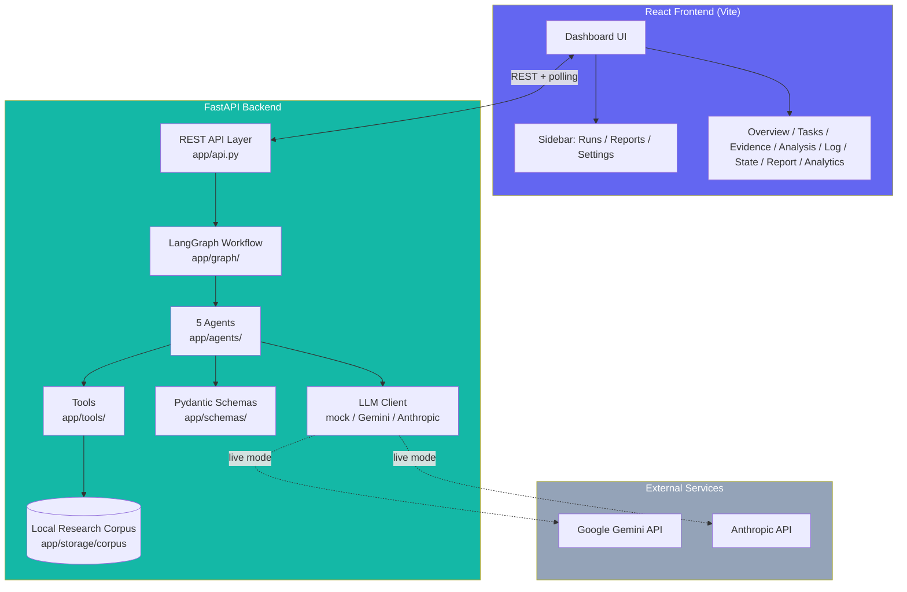
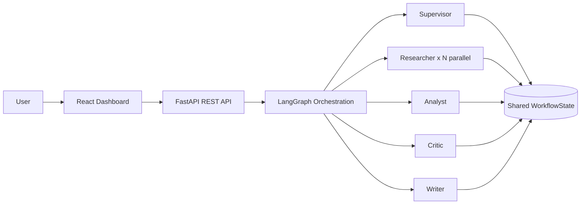

# Architecture Diagram

GitHub renders the Mermaid diagram below natively when this file is viewed
in the repo — no external image needed.

## System Architecture

## Layered View

## Component responsibilities

| Layer | Responsibility |
|---|---|
| React Frontend | Live dashboard — polls the backend, renders task plan/evidence/report/analytics, surfaces human checkpoints |
| FastAPI `app/api.py` | REST layer — starts/tracks runs on background threads, exposes 10 endpoints (see `backend/README.md`) |
| LangGraph `app/graph/` | Orchestration — state model, routing/conditional edges, human checkpoint blocking |
| Agents `app/agents/` | The 5 specialized roles (Supervisor, Researcher, Analyst, Critic, Writer) |
| Tools `app/tools/` | Search, extraction, evidence storage/retrieval, calculator |
| Schemas `app/schemas/` | Pydantic models — Task, Evidence, AnalysisOutput, CriticFeedback, FinalReport |
| LLM Client `app/services/llm_client.py` | Swappable mock / Gemini / Anthropic backend, with a hard timeout |
