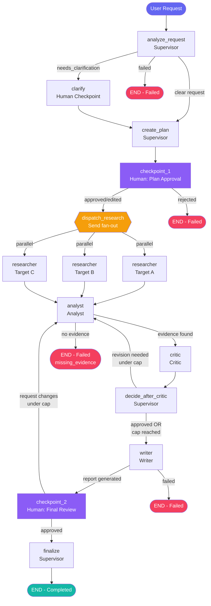

# Workflow Diagram

This matches the exact graph built in `app/graph/workflow.py` — every node
and edge here is a real node/edge in the code, not a simplified summary.



## Legend

- **Diamond (dispatch_research)** — conditional edge that returns a list of `Send` objects, one per ready research task, fanning out to parallel `researcher` invocations (Requirement 11).
- **Purple nodes (checkpoint_1, checkpoint_2)** — Human-in-the-Loop checkpoints (Requirement 12); these block the executing thread on a `threading.Event` until the frontend resolves them.
- **Red END nodes** — every terminal failure path is a *clean*, traceable termination (`workflow_status = failed` + a structured error in `state.errors`), never a crash (Requirement 14).
- **The Analyst ↔ Critic loop** — bounded by `max_revisions`; `decide_after_critic` is what actually enforces the cap via the `revision_forced_stop` flag (Requirement 10 — see `docs/experiment_5_revision_limits.md` for the off-by-one bug this fixed).

## Why this shape (vs. the assignment's suggested architecture)

The assignment's suggested architecture (Section 7) is:

```
User Request → Supervisor → Request Analysis → (Clarification? → User) → Research Plan
  → Research Task A / B → Evidence Store → Analyst → Critic
  → (Revision? → Research/Analyst | Approved → Writer) → Final Report → Execution Log
```

This implementation matches that shape almost exactly, with two additions:
a second human checkpoint after the Writer (Requirement 12 asks for *at
least two* checkpoints), and an explicit `decide_after_critic` node
separating "was a revision requested" from "is a revision still allowed"
so the cap enforcement is a single, testable function (see
`app/graph/routing.py::route_after_critic_decision`).
